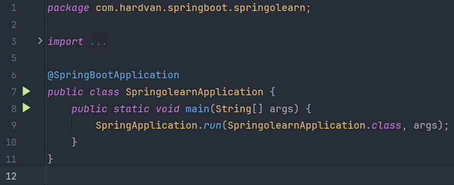

### Spring-o-Learn: Library Management System

Welcome to **Spring-o-Learn**, a Spring Boot-based Library Management System. This project allows users to browse a list
of books, add reviews, and delete all reviews associated with a book.

### Features

- **View Books**: Displays a list of books with their details (title, description, and reviews).
- **Add Review**: Users can submit a review for a specific book.
- **Delete All Reviews**: Users can remove all reviews for a specific book.

### Table of Contents

- [Getting Started](#getting-started)
- [Prerequisites](#prerequisites)
- [Project Installation](#project-installation)
- [Project Structure](#project-structure)
- [MVC Architecture Flow](#mvc-architecture-flow)
- [Data Flow](#data-flow-in-mvc)
- [Project Files Overview](#project-files-overview)

### Getting Started

This project is a basic implementation of Spring Boot's MVC architecture, using Thymeleaf as a templating engine. All
the book data is stored in a JSON file, and reviews are managed dynamically.

### Prerequisites

- **Java**: JDK 17+
- **Maven**: To manage dependencies and build the project.
- **Git**: To clone the project.

### Project Installation

1. **Clone the Repository**

    ```bash
    git clone https://github.com/Hardvan/Spring-o-Learn.git
    ```

2. Open the project in **IntelliJ IDEA**.

3. **Build the Project**: Ensure you have Maven installed. You can build the project using:

    ```bash
    mvn clean install
    ```

4. **Run the Project**: Run the Spring Boot application by going to
   the [`SpringolearnApplication`](src/main/java/com/hardvan/springboot/springolearn/SpringolearnApplication.java) class
   and clicking the green run button next to the main method. (Recommended)

    

   Alternatively, you can run the project using Maven:

    ```bash
    mvn spring-boot:run
    ```

The app will be available on `https://localhost:8090`.

> The port number 8090 is configured in the [`application.properties`](src/main/resources/application.properties) file.
> You can change it to any available port.

### Project Structure

```plaintext
Spring-o-Learn/
 └── src/
      ├── main/
      │    ├── java/com/hardvan/springboot/springolearn/
      │    │    ├── controller/         # Controllers (MVC)
      │    │    ├── model/              # Models
      │    │    ├── service/            # Services
      │    │    └── SpringolearnApplication.java # Main Application
      │    ├── resources/
      │    │    ├── templates/          # Thymeleaf HTML templates
      │    │    ├── static/             # CSS and static assets
      │    │    └── application.properties # App configuration
      └── test/                         # Test cases
```

### MVC Architecture Flow

The **Spring-o-Learn** project follows the MVC (Model-View-Controller) architecture.

1. **Model**: Contains the `Book` class representing a book entity with attributes like title, description, image URL,
   and reviews.

2. **View**: Thymeleaf is used to render HTML pages (in `resources/templates`). The `index.html` file displays the list
   of books along with forms to add or delete reviews.

3. **Controller**: `BookController` handles HTTP requests, directing user actions to the appropriate service. It fetches
   data from the `BookService` and passes it to the views for rendering.

4. **Service**: `BookService` reads book data from a JSON file (`books_data.json`) and contains business logic to manage
   reviews.

### Data Flow in MVC

- **Client Request**: Users send requests (e.g., to view books or add a review).

- **Controller**: The request is handled by the `BookController`, which interacts with the `BookService` for data
  management.

- **Service Layer**: The `BookService` fetches and updates the list of books and reviews stored in the `books_data.json`
  file.

- **Model**: The data fetched or modified by the service layer is encapsulated in the `Book` class.

- **View Rendering**: The `Controller` adds the necessary data to the `Model`, which is then passed to the Thymeleaf
  templates to render the UI.

### Project Files Overview

1. **SpringolearnApplication.java**: Main entry point for the Spring Boot application.
2. **BookController.java**: Handles routes such as viewing books (`/`), adding reviews (`/addReview`), and deleting
   reviews (`/deleteAllReviews`).
3. **Book.java**: Model class that represents a book with attributes: title, image URL, description, and reviews.
4. **BookService.java**: Service that manages books and reviews, reading data from `books_data.json`.
5. **index.html**: Thymeleaf template that displays all books, allows users to add reviews, and delete all reviews for a
   book.
